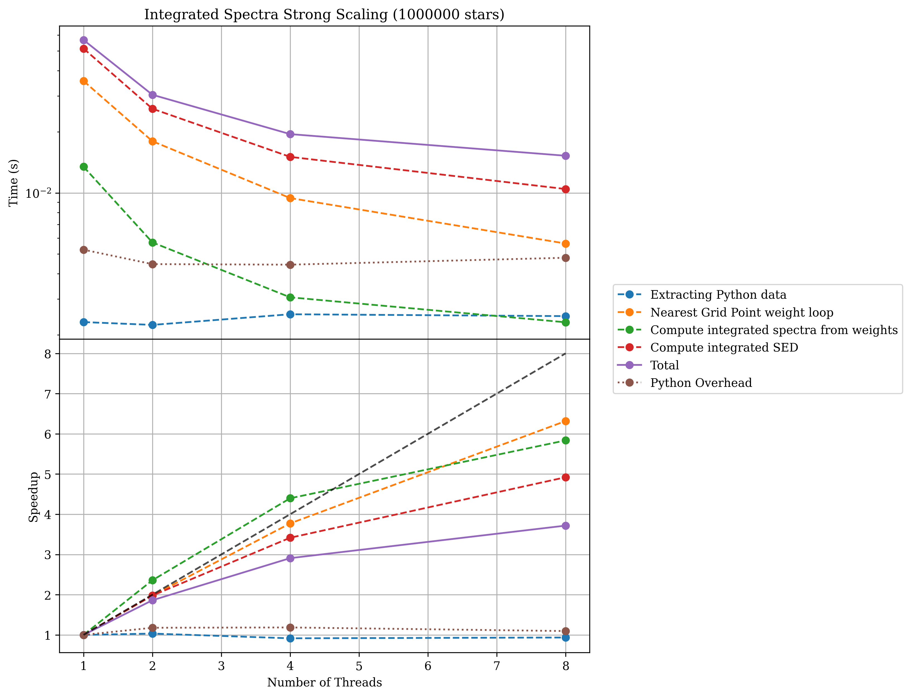
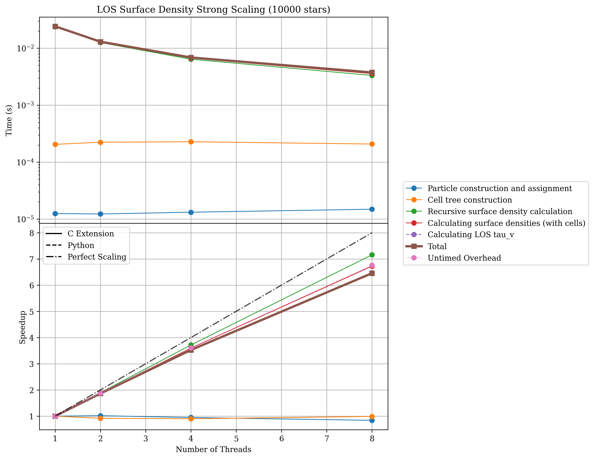

Parallelism
===========

In synthesizer we have implemented an optional model of parallelism, where distributed memory parallelism (MPI) is left in the hands of the user,
while shared memory parallelism (OpenMP) can be optionalyl invoked at a function call level for specific, intensive computations.
This allows the user to have fine-grained control over parallelism in their code, and to avoid overheads where parallelism is not required.

Shared Memory Parallelism (OpenMP)
----------------------------------

To use OpenMP threading in synthesizer, you need to first have OpenMP installed on your system, and to compile the code with the appropriate flags.
For more details see the `installation instructions <../getting_started/installation.rst>`_ and the `configuration options <../advanced/config_options.rst>`_.

Testing OpenMP
^^^^^^^^^^^^^^

To check that OpenMP is indeed being used in your code, you can import and use the ``check_openmp`` function.

.. code-block:: python

    from synthesizer import check_openmp
    check_openmp()

If OpenMP has been successfully configured, this function will return ``True``, otherwise it will return ``False``.

Using OpenMP Threading
^^^^^^^^^^^^^^^^^^^^^^

To avoid the pitfalls of the Python Global Interpreter Lock (GIL), we have focused on parallelisation of the C extensions used for spectra generation,
integration, Line-Of-Sight (LOS) surface density calculations, imaging, and other computationally intensive tasks. 
Making use of these threadpools is as simple as passing the ``nthreads`` argument to the relevant function. For example, to use 4 threads when generating spectra:

.. code-block:: python

    galaxy.get_spectra(..., nthreads=4)

The exact same would be true for any other function that supports OpenMP threading.

.. code-block:: python

    galaxy.stars.get_los_column_density(..., nthreads=4)

Scaling Performance
^^^^^^^^^^^^^^^^^^^

The performance of the code will scale with the number of threads used, up to the number of physical cores on your machine. 

Below is a plot showing the scaling of integrated spectra generation with the number of threads used (for a simple single spectra model). 
This test was run on an Apple Silicon M2 chip with 12 physical cores and 32GB of RAM.

And also a plot showing the scaling of LOS column density calculations with the number of threads used.

