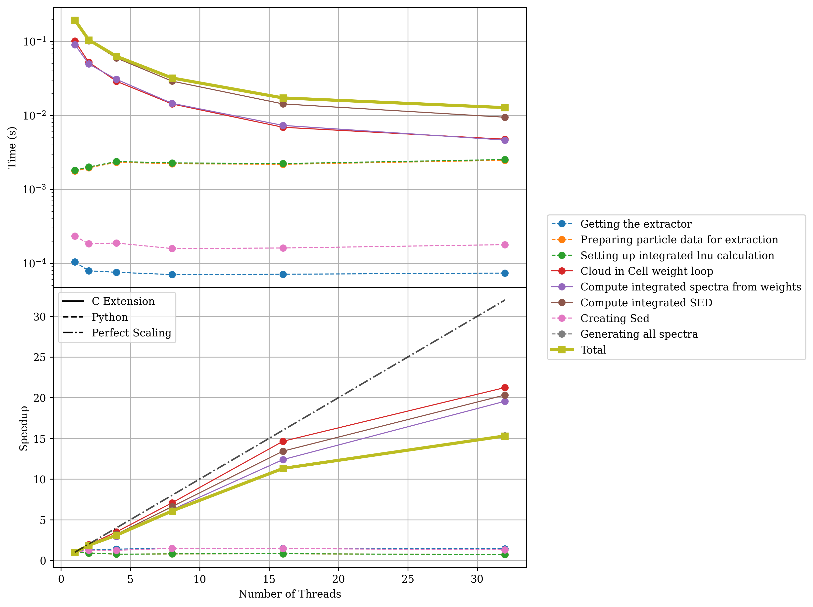
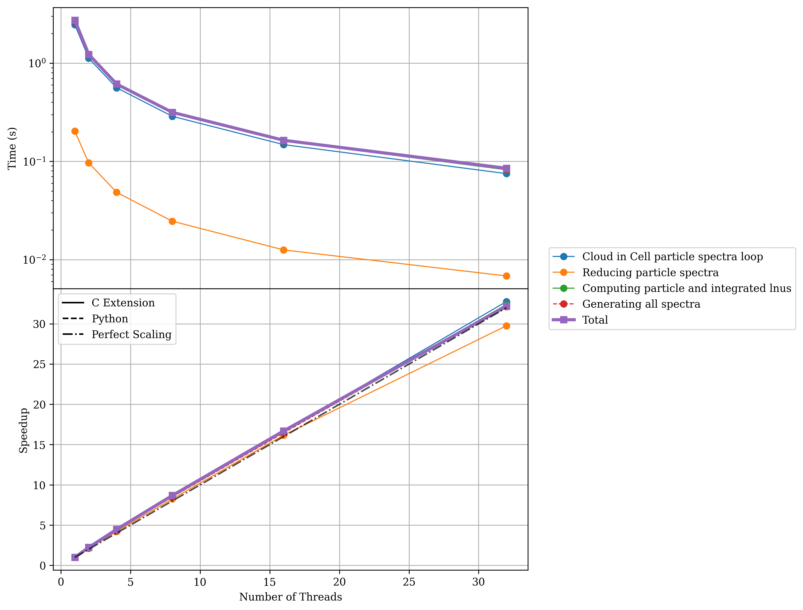
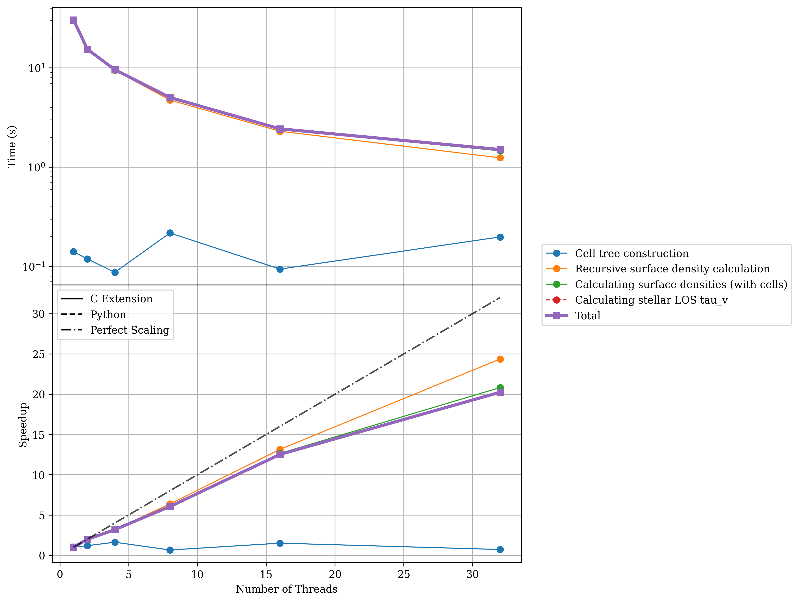
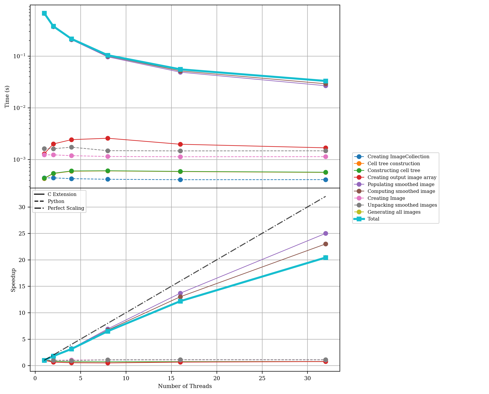

Performance 
=========== 

To ensure Synthesizer is performant enough to handle the large dynamic range of possible input datasets we have put a lot of effort into optimising the codebase. 
Needless to say, we are always looking for ways to improve performance further, so if you have any suggestions or find any bottlenecks, please do not hesitate to open an issue on GitHub.
We have implemented a number of performance optimisations, including:

- Using C++ extensions for computationally intensive tasks.
- Using OpenMP for shared memory parallelism to avoid the GIL bottleneck in Python. 
- Reducing memory allocations and copies as much as possible (including removing copies inherent during ``unyt`` conversion operations). 

We detail the OpenMP parallelism model we have implemented in the codebase in the section linked below.

.. toctree::
   :maxdepth: 1

   openmp

Profiling 
~~~~~~~~~ 

.. note::
    Before running the profiling suite, you will need to download the grids. See the `Downloading Grids <../getting_started/downloading_grids>`_ documentation for details.

To ensure the code remains performant, we have a bespoke profilling suite we maintain (and plan to expand) to test the performance of the codebase. 
This can be found in the ``profiling`` direcotory of the repository. 
In the following sections we show some performance benchmarks to give an idea of the performance of the codebase. All these tests were run on the Cosma8 HPC at Durham University. The output of the ``lscpu`` command is shown below, which gives an idea of the hardware used for these tests.

.. code-block:: 

    Architecture:             x86_64
      CPU op-mode(s):         32-bit, 64-bit
      Address sizes:          43 bits physical, 48 bits virtual
      Byte Order:             Little Endian
    CPU(s):                   128
      On-line CPU(s) list:    0-127
    Vendor ID:                AuthenticAMD
      Model name:             AMD EPYC 7542 32-Core Processor
        CPU family:           23
        Model:                49
        Thread(s) per core:   2
        Core(s) per socket:   32
        Socket(s):            2

Scaling Performance
^^^^^^^^^^^^^^^^^^^

The performance of the code will scale with the number of threads used, up to the number of physical cores on your machine. 

Integrated Spectra Scaling 
-------------------------- 

.. code-block:: bash 

    python strong_scaling_int_spectra.py --basename docs --nstars 1000000 --max_threads=32 --average_over 10 --low_thresh 0.01

Particle Spectra Scaling 
------------------------

.. code-block:: bash

    python strong_scaling_part_spectra.py --basename docs --nstars 10000 --max_threads=32 --average_over 10 --low_thresh 0.01

Line-Of-Sight (LOS) Column Density Scaling 
------------------------------------------

.. code-block:: bash 

    python strong_scaling_los_col_den.py --basename docs --nstars 1000000 --ngas 1000000 --max_threads=32 --average_over 10 --low_thresh 0.01

Smoothed Imaging Scaling
------------------------

.. code-block:: bash 

    python strong_scaling_images.py --basename docs --nstars 1000r --max_threads=32 --average_over 10 --low_thresh 0.01

